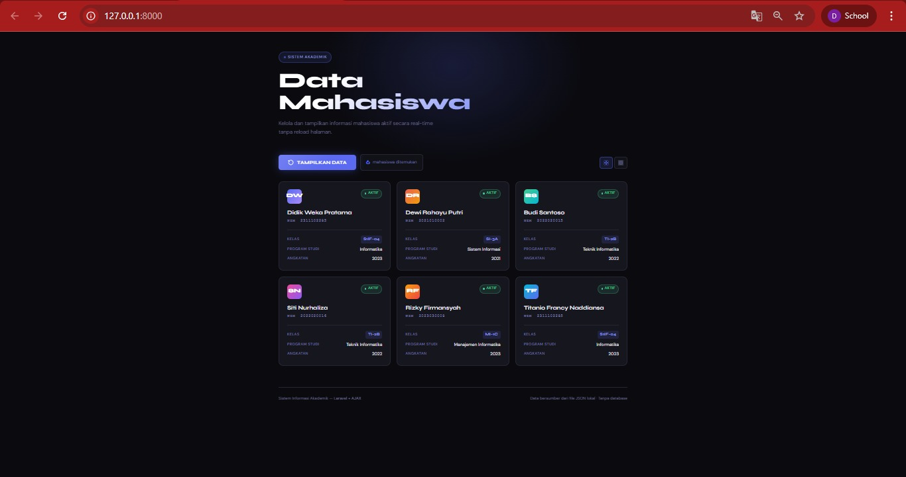

<div align="center">

# LAPORAN PRAKTIKUM  
# APLIKASI BERBASIS PLATFORM

## LARAVEL AJAX APP


### Disusun Oleh
**Didik Weka Pratama**  
2311102285  
IF-11-04  

### Dosen Pengampu
**Cahyo Prihantoro, S.Kom., M.Eng.**


### LABORATORIUM HIGH PERFORMANCE  
FAKULTAS INFORMATIKA  
UNIVERSITAS TELKOM PURWOKERTO  
2026

</div>

---

# 📚 Data Mahasiswa — Laravel AJAX App

Aplikasi web sederhana untuk menampilkan data mahasiswa menggunakan **Laravel**, **Blade**, dan **AJAX (XMLHttpRequest)**. Data bersumber dari file JSON lokal — **tanpa database**.

---

## Struktur File

```
laravel-mahasiswa/
├── app/
│   └── Http/
│       └── Controllers/
│           └── MahasiswaController.php
├── resources/
│   └── views/
│       └── mahasiswa/
│           └── index.blade.php
├── routes/
│   └── web.php
└── storage/
    └── app/
        └── data/
            └── mahasiswa.json
```

---

## Penjelasan Kode

### `storage/app/data/mahasiswa.json`
Menyimpan data mahasiswa dalam format array JSON sebagai pengganti database.

```json
[
    {
        "nama": "Andi Pratama Wijaya",
        "nim": "2021010001",
        "kelas": "SI-3A",
        "prodi": "Sistem Informasi",
        "angkatan": 2021,
        "status": "Aktif"
    }
]
```

---

### `routes/web.php`
Mendaftarkan dua route yang digunakan aplikasi.

```php
// Menampilkan halaman utama
Route::get('/', [MahasiswaController::class, 'index'])->name('mahasiswa.index');

// Mengembalikan data JSON untuk request AJAX
Route::get('/api/mahasiswa', [MahasiswaController::class, 'getData'])->name('mahasiswa.data');
```

---

### `MahasiswaController.php`
Berisi dua method utama.

```php
// Menampilkan halaman Blade
public function index()
{
    return view('mahasiswa.index');
}

// Membaca file JSON dan mengembalikannya sebagai response JSON
public function getData()
{
    $jsonPath    = storage_path('app/data/mahasiswa.json'); // path ke file JSON
    $jsonContent = file_get_contents($jsonPath);            // baca isi file
    $mahasiswa   = json_decode($jsonContent, true);         // ubah ke array PHP

    return response()->json([
        'success' => true,
        'total'   => count($mahasiswa),
        'data'    => $mahasiswa
    ]);
}
```

---

### `index.blade.php`
Halaman utama dengan tombol dan area hasil data. Saat tombol diklik, fungsi `fetchMahasiswa()` dipanggil menggunakan XMLHttpRequest.

```javascript
function fetchMahasiswa() {
    // Kirim request ke /api/mahasiswa tanpa reload halaman
    const xhr = new XMLHttpRequest();
    xhr.open('GET', '/api/mahasiswa', true);
    xhr.setRequestHeader('X-CSRF-TOKEN',
        document.querySelector('meta[name="csrf-token"]').content
    );

    xhr.onreadystatechange = function () {
        if (xhr.readyState === XMLHttpRequest.DONE && xhr.status === 200) {
            const res = JSON.parse(xhr.responseText);
            renderCards(res.data); // tampilkan hasil ke card/tabel
        }
    };
    xhr.send();
}

function renderCards(data) {
    // Buat card dari setiap data mahasiswa
    let html = '<div class="cards-grid">';
    data.forEach(function (mhs) {
        html += `
            <div class="card">
                <div class="card-nama">${mhs.nama}</div>
                <div>NIM: ${mhs.nim}</div>
                <div>Kelas: ${mhs.kelas}</div>
                <div>Prodi: ${mhs.prodi}</div>
            </div>
        `;
    });
    html += '</div>';
    document.getElementById('result-area').innerHTML = html;
}
```

---

## Cara Menggunakan

**1. Salin file project ke Laravel yang sudah ada**

Salin file-file berikut ke project Laravel kamu:

| File | Lokasi Tujuan |
|------|---------------|
| `MahasiswaController.php` | `app/Http/Controllers/` |
| `index.blade.php` | `resources/views/mahasiswa/` |
| `web.php` | `routes/` |
| `mahasiswa.json` | `storage/app/data/` |

**2. Install dependensi**
```bash
composer install
```

**3. Generate key dan jalankan server**
```bash
php artisan key:generate
php artisan serve
```

**4. Buka di browser**
```
http://127.0.0.1:8000
```

**5. Klik tombol "Tampilkan Data"** — data mahasiswa akan langsung muncul dalam bentuk card atau tabel tanpa reload halaman.

**6. Gunakan tombol toggle** untuk beralih antara tampilan card dan tabel.

## 7. Screenshot Website

1. Tampilan Web



